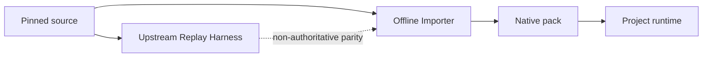

# M1 Architecture Documentation Alignment Audit

> Audit date: 2026-07-17
>
> Scope: external scenario/data-assets v1.0, Draft PR #5 documentation, merged PR #6 source
> evidence, current architecture documents, current execution contracts, and the selected
> Offline Import / Native Runtime decision.

## Internal Documentation Audit

### Verdict

- **Status**: inconsistent.
- **Main issue**: the v1.0 scenario plan assigns long-lived execution responsibility to external
  Benchmark adapters while Draft ADR-0002 assigns all production execution to the project runtime.
- **Scope reviewed**:
  - `/root/HJY/Agent安全评测_场景与数据资产建设方案_v1.0.md`
  - `origin/codex/reference-audit:docs/adr/0002-offline-import-native-runtime.md`
  - `origin/codex/reference-audit:docs/development/importer-spike-plan.md`
  - `docs/architecture/reference-informed-options.md`
  - `docs/reference-reuse-analysis.md`
  - `docs/development/ac-asset-ingestion-spike.md`

### Document Map

| Section / Doc | Apparent purpose | Notes |
| --- | --- | --- |
| Scenario/data-assets v1.0 | Define scenario assets, external reuse, oracles, and roadmap | Sound asset/oracle material is mixed with a conflicting runtime-adapter route. |
| Draft ADR-0002 | Decide the external-source boundary | Decision is coherent, but `Accepted` conflicts with its unmerged Draft status. |
| Draft importer plan | Bound three offline importer spikes | Core rules survive; Terminal-Bench source facts are superseded by PR #6. |
| PR #6 A/C inventory and spike | Fix current A/C source facts and native draft boundary | Already follows offline import and is authoritative for A/C source tuples. |
| Current reference analysis | Record M0 reuse options | Several pre-ADR phrases still imply AgentDojo or ClawSentry runtime adapters. |

### Findings

#### P1: Production runtime ownership has two incompatible answers

- **Type**: direct conflict and scope conflict.
- **Location**:
  - v1.0 lines 262-275, 490-507, 984-998, and 1047-1074.
  - Draft ADR-0002 lines 22-57, 81-109, and 129-139.
- **Evidence**:
  - v1.0 defines `executable_adapter`, proposes `SaberExternalBenchmarkAdapter` and
    `InspectEvalsExternalBenchmarkAdapter`, and routes asset work through Adapter reproduction.
  - ADR-0002 defines external Benchmarks as source languages, Importers as offline frontends, and
    the project runtime as the sole production runtime; it explicitly prohibits long-lived external
    Benchmark runtime adapters.
- **Impact**: M1 could start by implementing a second lifecycle, trace, cleanup, and truth boundary.
- **Repair**: replace.
- **Recommendation**: preserve ADR-0002's Offline Import / Native Runtime route and publish v1.1
  without a production external Benchmark runtime adapter.

#### P1: ADR lifecycle status contradicts GitHub state

- **Type**: lifecycle conflict.
- **Location**: Draft ADR-0002 line 3; PR #5 is Draft, open, and conflicting.
- **Evidence**:
  - The file says `Status: Accepted`.
  - GitHub PR #5 has not been reviewed or merged into `main`.
- **Impact**: readers may treat an unmerged proposal as repository policy.
- **Repair**: update.
- **Recommendation**: migrate the ADR as `Proposed`; change it to `Accepted` only in the reviewed
  replacement branch immediately before merge.

#### P1: Reuse mechanics and asset purpose share one enum

- **Type**: terminology drift and acceptance conflict.
- **Location**: v1.0 lines 262-275 and 490-507.
- **Evidence**:
  - `executable_adapter` describes an execution architecture.
  - `scenario_template`, `attack_seed`, `normal_task_fixture`, and `taxonomy_only` describe asset
    purposes.
- **Impact**: one value cannot answer both how material crosses the trust boundary and what the
  resulting asset is for; validation and dependency rules become ambiguous.
- **Repair**: split.
- **Recommendation**: use `reuse_mode` for `reference_only`, `asset_import`,
  `code_internalization`, and `upstream_replay`; use `asset_role` for scenario, seed, fixture,
  oracle, and taxonomy roles.

#### P2: Current reference prose still suggests post-ADR suite/event adapters

- **Type**: stale signal and terminology drift.
- **Location**:
  - `docs/architecture/reference-informed-options.md:118-120`.
  - `docs/reference-reuse-analysis.md:257-262`, `411-416`, `437`, `455`, and `471`.
- **Evidence**:
  - AgentDojo Task objects are assigned to a future suite adapter.
  - ClawSentry is described as a possible external event source through a conversion adapter.
  - The manifest already classifies ClawSentry event semantics as `DESIGN_REFERENCE` and Gateway,
    online models, and concrete adapters as `REJECT`.
- **Impact**: future developers can reintroduce the rejected runtime path under a generic
  `Benchmark Adapter` name.
- **Repair**: update.
- **Recommendation**: restrict `Adapter` to Target integration, use Offline Benchmark Importer for
  source conversion, and use Upstream Replay Harness for isolated parity checks.

### Remove / Update / Move Decisions

| Content | Decision | Reason | Suggested replacement |
| --- | --- | --- | --- |
| `executable_adapter` | remove | Creates a second production runtime | `upstream_replay` outside production |
| `import_mode` | split | Mixes mechanics and purpose | `reuse_mode` + `asset_role` |
| external Benchmark runtime adapter classes | remove | Duplicate lifecycle and truth ownership | Offline Importer + project runtime |
| ADR `Accepted` | update | Not merged or reviewed | `Proposed` |
| PR #5 manifest | remove from migration | Conflicts with merged PR #6 ownership | Current manifest + source locks + selection |
| generic `Benchmark Adapter` | update | Ambiguous runtime meaning | one of the three explicit terms |
| PyRIT `_memory` debt | move | Not part of the docs blocker | separate non-blocking issue |

### Open Decisions

- The exact `CompiledRunInput` fields are intentionally deferred to M1-A.
- Fixed Case counts per `BaseScenario` require later corpus evidence; they are not an M1 entry gate.
- Per-asset rights decisions remain open and block copying, not the architecture documentation.

### Suggested Repair Order

1. Migrate ADR-0002 as `Proposed` on latest main.
2. Publish the canonical v1.1 with split reuse metadata and native compilation boundary.
3. Reconcile PR #5 audit/spike facts with PR #6 source locks.
4. Narrow ClawSentry and AgentDojo language in current reference docs.
5. Open replacement PR, then close PR #5 as superseded.

## Documentation Against Code Audit

### Audit Conclusion

- **Conclusion**: conditional pass.
- **Summary**: P0:0 P1:2 P2:2 P3:0 needs-evidence:0.
- **Suggested fix order**: execution contract mismatch, attack-objective boundary, ClawSentry/AgentDojo
  terminology, then source-readiness examples.

### Audit Themes and Scenarios

- **Scenario compilation**: whether full scenario assets are correctly separated from the minimal
  execution projection.
- **Policy inputs**: whether benign task, attacker objective, and concrete attack seed remain distinct.
- **Reference reuse**: whether documents preserve current source locks and production dependency rules.
- **Observation reference**: whether ClawSentry claims match the capability manifest.

### 1. v1.0 models `ExecutionRunSpec` as a direct ScenarioCase product

- **Severity**: P1.
- **Location**:
  - Document: external v1.0 lines 142-155.
  - Code: `src/agentsec_eval/domain/models.py:26-55`.
- **Evidence**:
  - Document fragment:
    ```text
    ExecutionRunSpec = ScenarioCase x TargetConfiguration x AttackerConfiguration x BudgetSpec
    ```
  - Code fragment:
    ```python
    class ExecutionScenarioSpec(FrozenModel):
        """Minimal scenario projection required for one execution."""

    class ExecutionRunSpec(FrozenModel):
        scenario: ExecutionScenarioSpec
        attack_candidate: AttackCandidate
    ```
- **Impact**: M1 could make the full scenario model an execution-domain type or define a second
  `ExecutionRunSpec` instead of a compiler boundary.
- **Minimal fix**: document `ScenarioCase -> CompiledRunInput / ExecutionRunSpec` as the M1-A
  boundary, without freezing the intermediate shape here.
- **Repair value**: preserves M0-A's execution ownership and prevents duplicate domain types.
- **Principle**: code is truth; contract first.

### 2. v1.0 does not represent the explicit attack objective required by M0-C

- **Severity**: P1.
- **Location**:
  - Document: external v1.0 lines 115-155.
  - Code: `src/agentsec_eval/integrations/pyrit/policy.py:245-300`.
- **Evidence**:
  - v1.0 combines `AttackPayload` and execution attacker configuration without a compilation output
    for the attacker objective.
  - `PyRITAttackPolicy.run()` requires `attack_objective` separately from
    `run_spec.scenario.user_task` and `run_spec.attack_candidate.content`.
- **Impact**: a compiler following v1.0 could repeat the M0-C bug where a benign user task becomes
  the adversarial model's objective.
- **Minimal fix**: require the compiler output to preserve distinct normal task, attack objective,
  and concrete candidate content.
- **Repair value**: keeps policy semantics and benchmark assets aligned.
- **Principle**: contract first; safety boundary.

### 3. PR #5 Terminal-Bench facts are superseded by merged PR #6

- **Severity**: P2.
- **Location**:
  - Document: Draft importer plan lines 220-263 and Draft source audit Terminal-Bench section.
  - Config: `references/source-locks/ac-reference-sources.yaml:71-132`.
- **Evidence**:
  - PR #5 uses `harbor-framework/terminal-bench@d28711...` and `original-tasks/*`.
  - Current source lock uses `harbor-framework/terminal-bench-2@69671f...`, Harbor-native task paths,
    full-clone evidence, and `NOT_PRESENT_AT_FIXED_COMMIT` license status.
- **Impact**: a migrated spike could select the wrong repository, tasks, and license assumptions.
- **Minimal fix**: do not copy the old block; current source locks and A/C inventory are authoritative.
- **Repair value**: avoids provenance drift and rights mistakes.
- **Principle**: config/contract first.

### 4. ClawSentry runtime wording exceeds the manifest decision

- **Severity**: P2.
- **Location**:
  - Document: `docs/reference-reuse-analysis.md:257-262`, `437`, and `455`.
  - Config: `references/manifest.yaml:56-76`.
- **Evidence**:
  - Current prose allows an external event-source conversion adapter.
  - Manifest permits only event/trajectory semantics as `DESIGN_REFERENCE` and rejects Gateway,
    online models, and concrete adapters.
- **Impact**: target observation integration could accidentally depend on ClawSentry's online Gateway.
- **Minimal fix**: state that project-owned Target Adapters may borrow semantics but may not import or
  depend on ClawSentry runtime components.
- **Repair value**: keeps observation ownership and dependency closure project-controlled.
- **Principle**: code/config truth; explain repair value.

### Already Checked, No Modification Required

- M0-A/B/C execution, scorer, and policy validation reports correctly remain bounded validations.
- `docs/development/ac-asset-ingestion-spike.md` already defines offline static extraction and an
  optional isolated `upstream_replay`, with no production upstream runtime dependency.
- Current A/C source locks and import selection keep `copied_files` empty and block unapproved assets.
- The pinned PyRIT `_memory` check is real technical debt, but documentation does not claim a public
  API and CI enforces `pyrit==0.14.0`.

### Summary Statistics

| Level | Count |
| --- | ---: |
| P0 Blocker | 0 |
| P1 Major | 2 |
| P2 Minor | 2 |
| P3 Nit | 0 |
| Needs evidence | 0 |
| **Total** | **4** |

### Change Impact

| Surface | Needed | Notes |
| --- | --- | --- |
| Demo update | No | No runtime behavior changes. |
| Screenshot update | No | No UI. |
| Script update | No | Only docs/config wording. |
| Changelog | No | ADR and PR history provide the decision record. |
| External notification | Yes | Close PR #5 as superseded and link replacement. |

## Architecture Review

### Verdict

The current code and merged PR #6 are structurally healthy; the documentation is risky because it
offers two owners for execution. Fix the ownership story, not the M0 runtime.

### Architecture Map

```mermaid
flowchart LR
  U["Pinned upstream source"] --> I["Offline Benchmark Importer"]
  I --> P["Project-native Scenario Pack"]
  P --> C["ScenarioCase compiler"]
  C --> E["Project execution runtime"]
  E --> T["Project trace and oracles"]
  T --> O["Project final outcome"]
  U --> R["Upstream Replay Harness"]
  R -. "parity evidence only" .-> I
  R -.-X E
```

### Boundary

Reviewed boundary: external Benchmark knowledge and assets crossing into scenario assets and then
into one production execution runtime. Inspect AI and PyRIT are project-controlled execution/policy
integrations, not external Benchmark runtime ownership precedents.

### Review Lenses

- **Boundary and ownership clarity**: lifecycle, trace, cleanup, and final truth need one owner.
- **Dependency direction**: runtime must consume native contracts, never importer/upstream types.
- **Module depth and information hiding**: an Importer should hide source schemas and conversion loss.
- **Change amplification**: upstream upgrades should trigger re-import, not production runtime edits.
- **Security and policy boundary**: upstream Scores are evidence, not final truth.
- **Migration cost**: no production compatibility shim exists yet, so obsolete adapter concepts can
  be removed without code migration.

### Painful Center

The painful center is not parser complexity. It is the temptation to place SABER, Harbor,
AgentDojo, and other lifecycle-owning runtimes behind similarly named adapters. Such adapters are
shallow: callers still need to understand incompatible setup, scheduling, trace, score polarity,
cleanup, dependency, and license behavior. The common interface hides differences from the type
checker but not from operators or reviewers.

### Options

| Option | Boundary clarity | Current fit | Migration cost | Risk | Decision |
| --- | --- | --- | --- | --- | --- |
| Patch v1.0 while retaining external runtime adapters | Low | Fast locally | Medium ongoing | Multiple lifecycle/truth owners | Reject |
| ADR + canonical v1.1 + offline import and isolated replay | High | Matches code and PR #6 | Low before implementation | Importer work is explicit | Recommend |
| Reference-only, no imports | Very high | Too narrow for executable assets | Low | Cannot build native packs | Fallback when rights/semantics fail |

### Findings

#### P1: External runtime adapters are shallow lifecycle wrappers — Severity: High

- **What I found**: v1.0 proposes named long-lived runtime adapters while ADR-0002 and current A/C
  design assign parsing to offline Importers and execution to project contracts.
- **APoSD principle**: deep modules and information hiding.
- **Why it adds complexity**: change amplification and unknown unknowns; every upstream upgrade can
  alter setup, trace, Score, or cleanup semantics behind an apparently stable adapter.
- **Recommendation**: make source-specific Importers deep modules that emit native packs and loss
  reports; keep replay separate and non-authoritative.
- **Why-not / tradeoff**:
  - Keeping adapters preserves perfect upstream fidelity, but replay already owns fidelity checks
    without entering production.
  - Reference-only removes import complexity, but cannot produce executable native assets.
  - **Red team**: a developer calls a replay harness a `Benchmark Adapter` and routes campaigns to it.
  - **Blue team**: reserve three explicit terms and state dependency prohibitions in ADR-0002.
  - **Residual risk**: future process boundaries may resemble runtime adapters; architecture review
    must still ask who owns lifecycle and final truth.

#### P2: Full ScenarioCase and execution projection need a compiler boundary — Severity: High

- **What I found**: code intentionally keeps `ExecutionScenarioSpec` minimal and documents a future
  materialization function, while v1.0 directly expands ScenarioCase into ExecutionRunSpec.
- **APoSD principle**: information hiding and dependency direction.
- **Why it adds complexity**: without a compiler, execution types either absorb Benchmark details or
  Benchmark modules duplicate execution types.
- **Recommendation**: M1-A freezes the compiler contract; this docs change states inputs/outputs and
  invariants but does not define the full intermediate type.
- **Why-not / tradeoff**: embedding full ScenarioCase into execution makes one call site simpler but
  leaks assets, oracles, and provenance into every backend.

### What Is Already Good

- `ExecutionScenarioSpec` explicitly declares itself a minimal projection.
- M0-C keeps benign task, attacker objective, and concrete candidate content distinct.
- PR #6 separates capability manifest, source locks, import selection, and native draft design.
- Current A/C Importers are specified as fail-closed static transforms, not execution owners.

### Evidence Reviewed

- External v1.0, all sections 1-16 and Appendix A.
- Full Draft ADR-0002, Draft source audit, and Draft importer spike plan from PR #5.
- `src/agentsec_eval/domain/models.py`, `src/agentsec_eval/integrations/pyrit/policy.py`, and M0-A
  harness execution entry points.
- `references/manifest.yaml`, `references/source-locks/ac-reference-sources.yaml`,
  `references/import-selection/ac-seed-selection.yaml`.
- `docs/reference-assets/ac-source-inventory.md`, `docs/development/ac-asset-ingestion-spike.md`,
  and current reference architecture documents.
- Searches for `executable_adapter`, runtime adapter class names, `Benchmark Adapter`, ClawSentry,
  `import_mode`, `reuse_mode`, `asset_role`, and `upstream_replay` across all relevant refs.

### Next Step

Publish ADR-0002 as `Proposed`, then derive canonical v1.1 from the selected boundary before M1-A.

## SourceAssetReuseMetadata Data Model Audit

> Design principle: persist source provenance, reuse mechanics, and asset purpose as separate facts;
> never encode a production runtime choice in an asset-purpose enum.

### 1. SourceAssetReuseMetadata Table

No database table is proposed in this documentation phase. These are version-controlled manifest
and Scenario Pack metadata candidates; storage schema is deferred.

### 2. Config Fields

| Target field | Type | Classification | Field nature | Existence justification | Current field | Current source | Change |
| --- | --- | --- | --- | --- | --- | --- | --- |
| `source_id` | string | config | system | Non-redundant source identity | `source_id` / source key | v1.0 and source locks | keep |
| `repository` | URI | config | content | Required provenance | repository fields | manifest/source locks | keep |
| `commit` | full SHA | config | content | Required reproducibility | commit fields | manifest/source locks | keep |
| `source_path` | relative path | config | content | Required asset traceability | audited/source paths | source locks/selection | normalize |
| `license_status` | enum | config | system | Gates copying/import | code/data license fields | source locks | keep |
| `reuse_mode` | enum | config | system | Determines how material may cross the boundary | `import_mode`, integration mode, classification | v1.0/PR #5 | replace |
| `asset_role` | list[enum] | config | system | One asset may serve several non-runtime purposes | values inside `import_mode` | v1.0 | split/new |
| `conversion_loss_ref` | reference | config | content | Prevents silent semantic degradation | loss report prose | PR #5 plan | new candidate |
| `upstream_runtime_adapter` | class/config | remove | — | Existence questioned; replay owns fidelity | `executable_adapter` | v1.0 | remove |

`reuse_mode` values:

```text
reference_only | asset_import | code_internalization | upstream_replay
```

`asset_role` values:

```text
scenario_template | attack_seed | normal_task_fixture | oracle_candidate | taxonomy
```

### 3. Runtime Fields

- `production_runtime_eligible`: always false for `upstream_replay`; native pack eligibility is
  derived from project validation, rights approval, and compilation, not stored on an upstream
  runtime entry.
- `asset_import_allowed`: derived from `reuse_mode == asset_import`, approved license status, fixed
  source tuple, and selection approval.
- `replay_evidence_authoritative`: always false for final security truth; replay output may be parity
  evidence only.

### 4. Related Entities

| Target field | Type | Classification | Field nature | Existence justification | Current field | Current source | Change |
| --- | --- | --- | --- | --- | --- | --- | --- |
| SourceLock source tuple | object | config | system | Pins audited input | source entry | source-lock YAML | keep |
| ImportSelection selected record | object | config | system | Gates exact asset candidate | selection entry | import-selection YAML | keep |
| ScenarioAssetProvenance derivation | object | config | content | Links source to native asset | lineage candidate | A/C spike design | keep as candidate |
| UpstreamReplayRecord parity result | artifact | deferred | system | Needed only when replay is approved | none | not implemented | defer |

### 5. Change List

- **Renames**: none mechanically; old `import_mode` is not retained as an alias.
- **New fields**: `reuse_mode`, `asset_role`, and conversion-loss linkage in future native metadata.
- **Removals**: `executable_adapter`, `external_adapter`, and Adapter-oriented readiness flags.
- **Moves**: scenario/seed/fixture/taxonomy meanings move from reuse mechanics into `asset_role`.
- **API gaps**: no API exists or is required in this docs-only phase.

### 6. Design Decisions

| Decision | Reasoning |
| --- | --- |
| `reuse_mode` and `asset_role` are separate | Mechanics control dependency/rights; roles control downstream use. They vary independently. |
| `asset_role` is multi-valued | One fixed source record can inform a scenario template, oracle candidate, and taxonomy. |
| No runtime-adapter field | Runtime ownership is an architecture invariant, not per-asset tuning. |
| No DB classification yet | M1-A has not selected storage or a stable Scenario Pack schema. |

## Hai Razor: External Benchmark Reuse Boundary

### Verdict

- **Verdict**: replace the current mixed shape.
- **One-line reason**: asset roles are real; long-lived external Benchmark runtime adapters are not
  necessary because isolated replay preserves fidelity without duplicating production ownership.
- **Razor principle used**: a concept survives only if deleting it breaks an irreducible goal or
  moves unavoidable complexity to a worse owner.

### Audit Scope

- **Chain / targets**: source reuse modes, asset roles, adapter/importer/replay concepts, source
  readiness, scenario objects, and first milestones.
- **Current goal**: build provenance-complete project-native scenarios executable by one runtime.
- **Not audited**: exact M1-A schema fields, importer implementation, corpus size, storage, and worker
  parallelism.

### Evidence

| Source | What was seen | Supports / weakens verdict | Confidence |
| --- | --- | --- | --- |
| ADR-0002 | Explicit dependency and lifecycle rules | replace runtime adapters | High |
| Current execution code | One project run contract and project-controlled policy | keep native runtime/compiler | High |
| PR #6 inventory | Offline fail-closed drafts already express A/C inputs | keep Importer/source locks | High |
| v1.0 | One mixed enum and Adapter-oriented milestones | replace enum; delete adapters | High |
| Rights status | Several assets remain `REVIEW_REQUIRED` | prove first for `asset_import` | High |

### Before / After




### Razor Map

| Concept | Claimed purpose | What breaks if deleted | Hidden owner | Verdict | Reason |
| --- | --- | --- | --- | --- | --- |
| `BaseScenario` | Long-lived scenario template | Scenario family knowledge has no owner | scenario assets | Keep | Real reusable distinction |
| `ScenarioCase` | Fixed versioned instance | Compilation and replay lose stable input identity | scenario assets | Keep | Required M1-A source object |
| `AttackSeed` | Attack content/steps | Mutation lineage loses its source | corpus/scenario assets | Keep | Distinct from scenario and truth |
| Scenario Pack | Native distributable asset | Runtime would depend on source formats | scenario assets | Keep | Internal IR boundary |
| Offline Benchmark Importer | Hide source-specific parsing/loss | Callers absorb every source schema | importer | Keep | Deep module |
| Upstream Replay Harness | Fidelity/parity evidence | Paper reproduction and parity checks disappear | isolated replay tooling | Keep | Bounded non-production owner |
| Target Adapter | Connect evaluated Agent | Target calls have no capability/observation boundary | target integration | Keep | Production integration, not Benchmark runtime |
| mixed `import_mode` | Describe reuse and purpose | Nothing; two fields are clearer | metadata | Replace | Conflates independent dimensions |
| `executable_adapter` | Preserve upstream execution | Replay must absorb parity work | replay harness | Delete | No production goal breaks |
| long-lived Benchmark runtime classes | Hide upstream runtime differences | Replay/importer absorb real needs | importer/replay | Delete | Shallow wrappers over second kernels |
| `ADAPTER_READY` | Source maturity | Nothing; per-asset gates remain | source approval | Delete | Wrong architecture encoded as state |
| two initial Importer spikes | Prove conversion boundary | Importer design remains untested | M1 follow-up | Keep | Bounded proof after M1-A |
| Terminal-Bench Importer spike | Fixture conversion evidence | No M1 entry invariant breaks now | later asset work | Defer | Current source rights remain blocked |
| fixed 10/12 cases per BaseScenario | Corpus quality target | No current runtime invariant breaks | corpus planning | Prove first | No empirical density evidence yet |
| PyRIT compatibility helper | Isolate private API | Current exact pin still contains drift | integration debt | Defer | Real debt, not this blocker |

### To Cut or Merge

| Concept | Action | Strongest survival argument | Why it still falls short |
| --- | --- | --- | --- |
| `executable_adapter` | Delete | Highest-fidelity execution of the source | Isolated replay provides fidelity without campaign ownership |
| long-lived source runtime adapters | Delete | Faster initial integration | Permanent lifecycle, dependency, and oracle cost exceeds parser work |
| mixed `import_mode` | Replace | One field is simpler to serialize | It cannot express mechanics and role independently |
| Adapter readiness state | Delete | Familiar integration maturity signal | It approves the wrong architecture and duplicates per-asset gates |
| Terminal importer in first S1 | Defer | Normal-task fixtures are valuable | Rights and M1-A compiler boundary are not yet complete |

### Complexity To Preserve

| Concept | Why preserved | Boundary that must not be mis-cut |
| --- | --- | --- |
| Source-specific parsing and loss reports | Real semantic complexity belongs in Importers | Do not reduce to generic string maps |
| Replay isolation and cleanup | Upstream fidelity can be risky and stateful | Never run as production campaign backend |
| Provenance and rights gates | Prevent untraceable copying and license mistakes | Do not merge with runtime readiness |
| Separate utility/security/objective truth | Prevent upstream score pollution | Do not collapse into one pass/fail |
| Scenario-to-execution compiler | Protects both asset and execution domains | Do not duplicate execution types |

### Shape After the Razor

Only three integration terms remain: Target Adapter, Offline Benchmark Importer, and Upstream Replay
Harness. Source mechanics use `reuse_mode`; asset purpose uses `asset_role`. Native Scenario Packs
compile into execution inputs, and only the project runtime owns production lifecycle and truth.

### Risks & Guardrails

- **Likely rebound**: a future source-specific replay wrapper is renamed `Benchmark Adapter` and
  gains campaign routing.
- **Mis-cut risk**: deleting replay would erase valuable parity and paper-reproduction evidence.
- **Guardrails**: ADR dependency rules, reserved terminology, no-upstream-package pack test, explicit
  loss reports, and M1-A compiler acceptance tests.

### Next Steps

Apply the cut list in ADR-0002, v1.1, current reference prose, and the importer spike plan. This is a
bounded local audit; an HTML artifact would add ceremony without clarifying this single chain, so it
is intentionally omitted.

## Hai Rewrite Doc: Scenario and Data Assets v1.0

### Anchor

1. External Benchmarks are source languages; project-native Scenario Packs are the internal IR.
2. Production execution uses only the project runtime; external runtimes are isolated replay only.
3. Reuse mechanics and asset purpose are separate metadata dimensions.
4. Full scenario assets compile/materialize into existing execution contracts; they do not redefine
   those contracts.
5. ClawSentry is a pinned Beta design reference only; Gateway, online decisions, models, and concrete
   adapters are rejected.
6. M1 begins with the native ScenarioCase compilation boundary, not an external runtime adapter.
7. Current source locks and PR #6 inventory supersede conflicting source tuples from PR #5/v1.0.
8. PyRIT private-memory compatibility work is non-blocking and outside this rewrite.

### Rewritten Document

Target path: `docs/architecture/scenario-data-assets-v1.1.md`

### Disposition Table

| # | Old block | Verdict | Check passed / failed |
| ---: | --- | --- | --- |
| 1 | Title and companion-document purpose | Keep | Still describes the scenario/data-assets planning surface (anchor 1). |
| 2 | v1.0 version/date frame | Delete | Superseded by canonical v1.1 and current 2026-07-17 baseline. |
| 3 | Core conclusion using generic Adapter | Delete | Fails anchors 1-3; replacement comes from the selected native route. |
| 4 | Section 1 goals/questions | Keep | Questions remain valid and do not prescribe runtime ownership. |
| 5 | Section 1 asset tree: coverage, scenarios, fixtures, oracles, lineage, provenance, regression | Keep | Each has a current owner/evidence need. |
| 6 | Section 1 asset tree: `Benchmark Adapter` | Delete | Fails anchor 2 and reserved terminology. |
| 7 | Section 2 Scenario Family | Keep | Real reporting/corpus grouping; no execution dependency. |
| 8 | Section 2 BaseScenario | Keep | Long-lived scenario-template distinction survives (razor Keep). |
| 9 | Section 2 ScenarioCase | Keep | Fixed versioned input for M1-A survives (anchor 4). |
| 10 | Section 2 AttackSeed | Keep | Correctly distinct from scenario and truth. |
| 11 | Section 2 direct `ExecutionRunSpec = ScenarioCase x ...` equation | Delete | Contradicts `domain/models.py:26-55`; replacement comes from anchor 4. |
| 12 | Section 2 `ExecutableScenarioPack` concept and contents | Keep | Native pack remains the internal IR; exact storage layout is not frozen. |
| 13 | Section 3 trusted/untrusted planes | Keep | Matches M0 evidence ownership, with future components marked proposed. |
| 14 | Section 3 realism levels | Keep | Useful scenario planning distinction; no runtime-adapter dependency. |
| 15 | Section 4.1 reuse/non-reuse principles | Keep | Consistent with ADR evidence and project final-truth ownership. |
| 16 | Section 4.2 project matrix and `import_mode` column | Delete | Mixes roles/mechanics and includes production runtime adapters. |
| 17 | SABER source facts and A/B/C concepts | Keep | Verified at current source lock; rights caveats remain. |
| 18 | SABER “directly reusable runtime logic/assets” wording | Delete | Current source lock blocks raw copying and runtime dependency (anchor 7). |
| 19 | Inspect Evals/CodeIPI source concepts and scorer-audit warning | Keep | Verified by source inventory; upstream Score is non-authoritative. |
| 20 | Terminal-Bench fixture/utility roles | Keep | Current PR #6 inventory supports these roles. |
| 21 | AgentDojo environment/oracle concepts | Keep | Valid as design/import candidates. |
| 22 | AgentDojo process-level Adapter route | Delete | Fails sole-runtime rule (anchor 2). |
| 23 | AutoDojo policy-reference role | Keep | Design reference only, no runtime ownership. |
| 24 | ClawSafety/SafeClawBench endpoint concepts | Keep | Scenario/taxonomy roles only. |
| 25 | AppWorld/tau normal-task and end-state concepts | Keep | Design/import candidates; rights remain gated. |
| 26 | MCP source concepts | Keep | Taxonomy/local reconstruction roles survive. |
| 27 | MCP executable Adapter candidate | Delete | Fails sole-runtime rule and live-service repeatability. |
| 28 | SHADE-Arena separate sabotage family | Keep | Preserves a distinct threat model and reporting boundary. |
| 29 | Section 5 source channels A-E | Keep | Sources remain useful when they feed native assets. |
| 30 | Section 5 five-value `import_mode` | Delete | Fails anchor 3; replacement is `reuse_mode` + `asset_role`. |
| 31 | Section 6 coverage axes/rules/health metrics | Keep | Asset-quality planning remains valid; not an Agent total score. |
| 32 | Section 7 hard 10/12 fixed Case requirement | Undecided | No current corpus evidence proves density; deferred to corpus review. |
| 33 | Section 7 Case field example | Keep | Useful intent, but source metadata uses split fields and types remain candidates. |
| 34 | Section 8 first six/twelve scenario list | Keep | Long-term candidate roadmap, explicitly not M1 entry acceptance. |
| 35 | Section 8 three SABER data layers | Keep | Replay/native/derived distinction survives with replay non-production. |
| 36 | Section 9 scenario construction workflow | Keep | Native task/auth/oracle/reset flow remains valid. |
| 37 | Section 9 “external run converts directly to result types” | Delete | External runtime may only produce replay evidence, not production output. |
| 38 | Section 10 Oracle Audit | Keep | Matches project evidence and final-truth boundary. |
| 39 | Section 11 source-registration intent | Keep | Current manifest/source locks provide the actual representation. |
| 40 | Section 11 `integration_modes`, `adapter_ready`, and `ADAPTER_READY` state | Delete | Encodes rejected architecture; per-asset gates replace it. |
| 41 | Section 11 external-code management principles | Keep | Pinning, attribution, and no bulk copy remain valid. |
| 42 | Section 12 fixed project directory tree | Delete | Current task forbids pre-freezing directories/domain layout. |
| 43 | Section 13 data layers and anti-contamination rules | Keep | Preserve with upstream replay isolated and non-authoritative. |
| 44 | Section 14 S0 schema/registry before compiler | Delete | M1-A compiler boundary must precede broad model/registry work (anchor 6). |
| 45 | Section 14 S1 external Adapter spikes | Delete | Directly contradicts anchors 1-2 and ADR-0002. |
| 46 | Section 14 native pack/corpus/cross-domain milestones | Keep | Valid later roadmap, not current acceptance. |
| 47 | Section 15 work streams except Adapter Engineering | Keep | Responsibilities remain useful. |
| 48 | Section 15 Adapter Engineering | Delete | Replacement is Importer/Replay Engineering from anchor 2. |
| 49 | Section 16 source-role decisions | Keep | Roles survive when expressed as import/reference/replay. |
| 50 | Section 16 SABER/Inspect external Adapter priority | Delete | Contradicts anchors 1-2. |
| 51 | Section 16 six/twelve scenario counts | Undecided | Retain as planning hypothesis, not frozen requirement. |
| 52 | Section 16 final chain through Adapter reproduction | Delete | Replacement chain comes from anchors 1, 2, 4, and 6. |
| 53 | Appendix A floating source identifiers | Delete | Current fixed source locks/inventory are authoritative (anchor 7). |

### Open Questions

1. What evidence should set the fixed Case count per `BaseScenario`? This blocks making 10/12 a hard
   acceptance rule, but does not block v1.1.
2. What exact fields belong in `CompiledRunInput`? This is the M1-A decision and is intentionally
   absent from v1.1.
3. Which selected source assets have sufficient rights for `asset_import`? This blocks individual
   imports, not the architecture route.

### Next Step

Write v1.1 only from the Anchor and Keep verdicts, using current source locks for all source facts.
